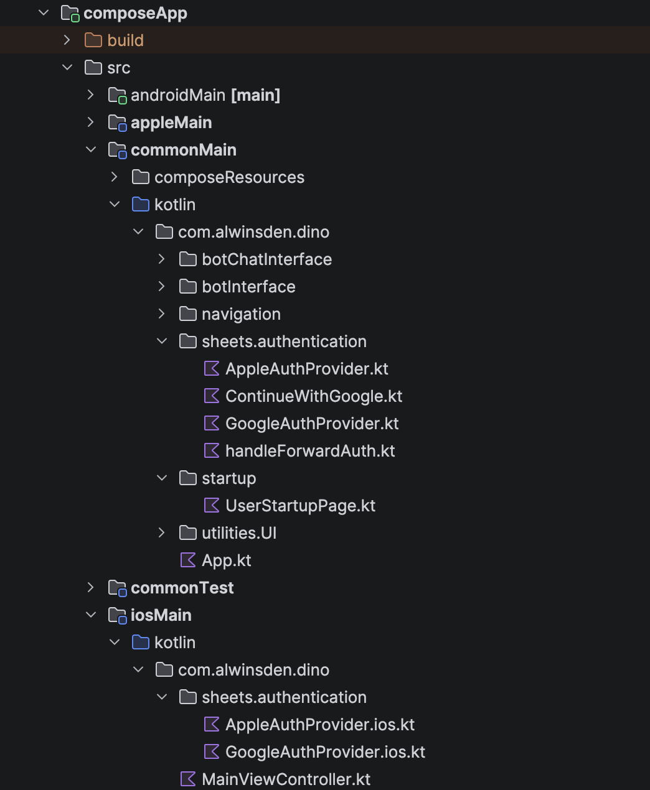

:::info
If new, checkout KMP architecture @ [KMP - Build Cross-platform](https://kotlinlang.org/multiplatform/)
:::

Since Compose Multi-platform combines the UI aspect for both **_iOS and Android_**, how do you implement Google authentication such that the UI code remains unified while maintaining the ideal authentication flow specific to these platforms in  Kotlin without using a KMP library?

<!-- truncate -->

### Kotlin Multiplatform simplified


Refer to [Project Synapse code](https://github.com/alwinsDen/mirror-Project-Synapse) for understanding of the archiecture. Basically, the UI layer of the application is shared between iOS and Android (composeApp module), with shared module acting as the common ground for business logic between UI and backend server, while Ktor-based server rests in the server module. More [here](https://kotlinlang.org/docs/multiplatform/multiplatform-discover-project.html).

<!-- truncate -->

### The GAuth

There are two most common things in a Google authentication flow

1. The user manually signs in to the app by tapping the Sign in with Google button.
2. The user is automatically signed in, either from previously stored session state or via a bottom sheet that lets them pick from existing Google accounts.

In this article, we explore implementation of Google authentication for Android while maintaining **a common UI on a KMP app.**

:::warning
For this app, the KMP implementation for Android is straight forward compared to iOS, in iOS we use cinterop library to communicate with native iOS Objective C code. Code [**here**](https://github.com/alwinsDen/mirror-Project-Synapse/tree/main/shared/src/iosMain/kotlin/authManager/ClickTriggerAuth.kt).
:::

<!-- truncate -->

### Setting up, expect / actual functions


The above is the structure of our Compose Multiplatform app. The `commonMain` module contains the shared UI code for both Android and iOS platforms, while platform-specific implementations reside in the `androidMain` and `iosMain` modules.

In our implementation, the Sign in with Google UI interface will be shared, but the behaviour will be controlled by platform specific code.

:::info
Since this is not an introduction to expect / actual functions, if you are new to this, it is better to refer [compose documentation](https://kotlinlang.org/docs/multiplatform/multiplatform-expect-actual.html) on this.
:::

The implementation of UI button in commonMain:

```kotlin
@Composable
fun ClickableContinueWithGoogle(nonce: String, handleReceivedGoogleTokenId: (String) -> Unit) {
    val authProvider = rememberGoogleAuthProvider()
    val scope = rememberCoroutineScope()
    var loaderState by remember { mutableStateOf(false) }

    // Auto sign-in check on component mount
    LaunchedEffect(nonce) {
        if (nonce == Defaults.default) return@LaunchedEffect
        loaderState = true
        authProvider.checkExistingCredentials(nonce)?.let { token ->
            handleReceivedGoogleTokenId(token)
        }
        loaderState = false
    }

    Image(
        painter = painterResource(Res.drawable.btn_android_id_rec),
        contentDescription = "Continue with Google",
        contentScale = ContentScale.FillWidth,
        modifier = Modifier.fillMaxWidth(.5f)
            .clickable {
                scope.launch {
                    if (nonce == Defaults.default) return@launch
                    loaderState = true
                    authProvider.signIn(nonce)
                        .onSuccess { token ->
                            handleReceivedGoogleTokenId(token)
                        }
                        .onFailure { exception ->
                            // TODO: Handle error properly
                            println("Sign-in failed: ${exception.message}")
                        }
                    loaderState = false
                }
            }
    )
}
```

So what exactly is this? This is a composable function in which we define `ClickableContinueWithGoogle` which has two ways to trigger a sign in. Our automated implementation triggers in a `LaunchdedEffect` and a modifier with clickable property. Both these use methods from `rememberGoogleAuthProvider()` - an expect implementation which we explore next.

<!--truncate -->

### expect implementation for `rememberGoogleAuthProvider`

```kotlin
/**
 * Interface for Google authentication functionality across platforms.
 * Provides a common abstraction for Google Sign-In operations.
 */
interface GoogleAuthProvider {
    /**
     * Initiates the sign-in flow with the provided nonce.
     *
     * @param nonce The nonce value from the server for token validation
     * @return Result containing the Google ID token on success, or an error
     */
    suspend fun signIn(nonce: String): Result<String>

    /**
     * Checks for existing credentials without prompting the user.
     * Useful for automatic sign-in on app launch.
     *
     * @return The existing Google ID token if available, null otherwise
     */
    suspend fun checkExistingCredentials(nonce: String): String?
}

/**
 * Platform-specific factory function to create a GoogleAuthProvider instance.
 * Each platform provides its own implementation.
 */
@Composable
expect fun rememberGoogleAuthProvider(): GoogleAuthProvider
```

This expect composable has an actual implementation for each Android & iOS. This defines an _interface_ on how the returned class properties need to be structured.

Since we are defining actual functions to be platform specific, we need to use native libraries.

For Android, we install Google credentials libs in `androidMain/build.gradle.kts` file:

```kotlin
val credentialVersion = "1.6.0-rc01"
implementation("androidx.credentials:credentials:$credentialVersion")
implementation("androidx.credentials:credentials-play-services-auth:$credentialVersion")
implementation("com.google.android.libraries.identity.googleid:googleid:1.1.1")
```

<!--truncate-->

### Android's actual implementation:

```kotlin
import android.content.Context
import android.util.Log
import androidx.compose.runtime.Composable
import androidx.compose.runtime.remember
import androidx.compose.ui.platform.LocalContext
import androidx.credentials.*
import androidx.credentials.exceptions.GetCredentialException
import com.alwinsden.dino.BuildKonfig
import com.google.android.libraries.identity.googleid.GetGoogleIdOption
import com.google.android.libraries.identity.googleid.GetSignInWithGoogleOption
import com.google.android.libraries.identity.googleid.GoogleIdTokenCredential
import com.google.android.libraries.identity.googleid.GoogleIdTokenParsingException

@Composable
actual fun rememberGoogleAuthProvider(): GoogleAuthProvider {
    val context = LocalContext.current
    return remember {
        AndroidGoogleAuthProvider(
            context = context,
            credentialManager = CredentialManager.create(context)
        )
    }
}
```

#### Suspended signIn function

```kotlin
override suspend fun signIn(nonce: String): Result<String> {
    return try {
        val signInWithGoogleOption = GetSignInWithGoogleOption.Builder(
            serverClientId = BuildKonfig.CLIENT_ID_GOOGLE_AUTH
        )
            .setNonce(nonce)
            .build()

        val request = GetCredentialRequest.Builder()
            .addCredentialOption(signInWithGoogleOption)
            .build()

        val result = credentialManager.getCredential(
            request = request,
            context = context
        )

        Log.i(TAG, "Manual Google Sign-in success")
        extractGoogleIdToken(result)
    } catch (e: GetCredentialException) {
        Log.e(TAG, "Error getting credential", e)
        Result.failure(e)
    }
}
```

Here BuildKonfig is a generated object created by a popular Kotlin Multiplatform (KMP) Gradle plugin called [BuildKonfig](https://github.com/yshrsmz/BuildKonfig). It injects the Google console auth key from `secrets.properties` file. more [here](https://github.com/alwinsDen/mirror-Project-Synapse/tree/main/composeApp/build.gradle.kts#L100).

### What is Nonce here?

This is a safety mechanism in place to prevent replay attacks. Nonce flows from the server, usually a JWT token.

```shell
| Backend System                              |
|---------------------------------------------|
| 1. Generate Secure Nonce                    |
|    & Save to Valkey/Redis                   |
|               |                             |
|               v                             |
| 2. Share Nonce with CLI/Client              |
|               |                             |
|---------------|-----------------------------|
                |
                v
| CLI / Client Application                    |
|---------------------------------------------|
| 3. Init GAuth Builder (setNonce)            |
|               |                             |
|               v                             |
| 4. Perform Google Sign-In                   |
|    (Result: Encrypted Token ID w/ Nonce)    |
|               |                             |
|               v                             |
| 5. Send Token ID to Backend                 |
|               |                             |
|---------------|-----------------------------|
                |
                v
| Backend System                              |
|---------------------------------------------|
| 6. Verify Google Token Signature            |
|               |                             |
|               v                             |
| 7. Extract Nonce & Check Valkey/Redis       |
|               |                             |
|    [  Exists & Matches?  ]                  |
|       | Yes           | No                  |
|       |               +----> | Reject |     |
|       v                                     |
| 8. Generate Custom App JWT                  |
|               |                             |
|               v                             |
| 9. Return JWT to CLI (Login Success)        |
|_____________________________________________|
```

#### Suspended checkExistingCredentials function

```kotlin
override suspend fun checkExistingCredentials(nonce: String): String? {
    return try {
        val googleIdOption = GetGoogleIdOption.Builder()
            .setFilterByAuthorizedAccounts(true)
            .setAutoSelectEnabled(true)
            .setServerClientId(BuildKonfig.CLIENT_ID_GOOGLE_AUTH)
            .setNonce(nonce)
            .build()

        val request = GetCredentialRequest.Builder()
            .addCredentialOption(googleIdOption)
            .build()

        val result = credentialManager.getCredential(
            request = request,
            context = context
        )

        Log.i(TAG, "Auto Google Sign-in success")
        extractGoogleIdToken(result).getOrNull()
    } catch (e: GetCredentialException) {
        Log.d(TAG, "No existing credentials found", e)
        null
    }
}
```

In either case, the returned Google token ID, serves the same primary function.

This expect function also has a corresponding implementation in iOS which requires a more complex setup and will be discussed in an upcoming article. Until then check the code [here](https://github.com/alwinsDen/mirror-Project-Synapse/tree/main/shared/src/iosMain/kotlin/authManager/ClickTriggerAuth.kt).

<!--truncate-->

:::success
This is my first article on KMP, which I too am new to. If you have any feedback or suggestions, please feel free to reach out to me.
Until then, consider starring the [project](https://github.com/alwinsDen/mirror-Project-Synapse) and follow me on [GitHub](https://github.com/alwinsDen).
:::
