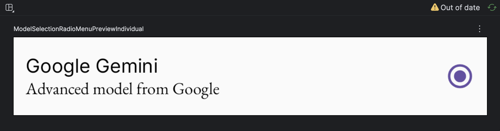
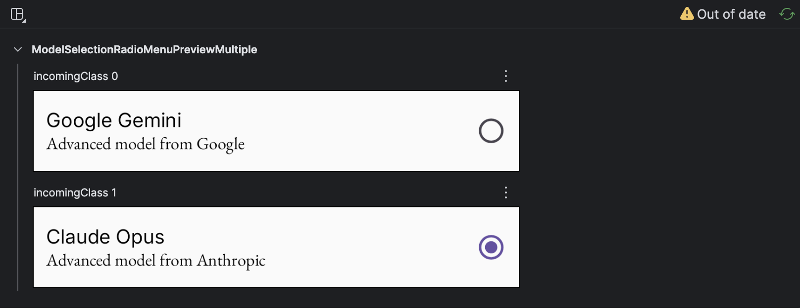
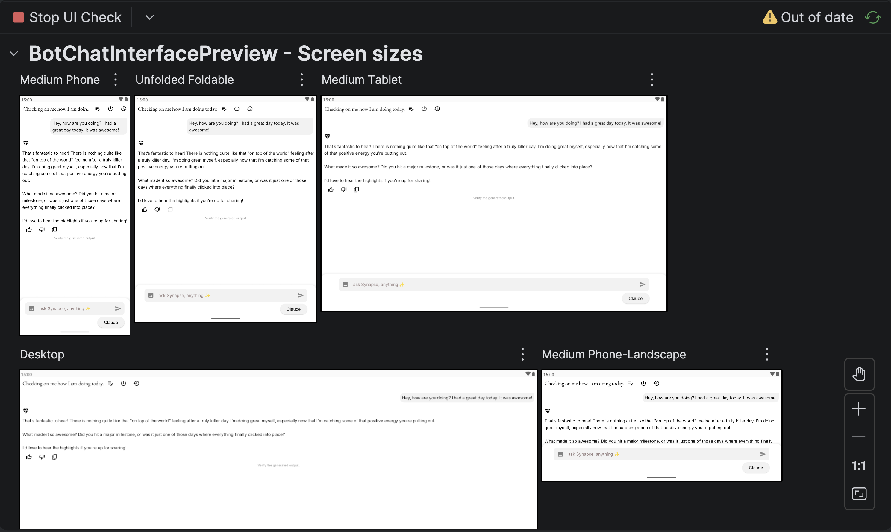

:::info
This is the 2nd article in **Understanding KMP** series. Check out the previous one [here](/articles/kmp-gauth-multiplatform)!
:::

Since the last post, a lot has changed on Project Dino, now renamed to [Synapse](https://github.com/alwinsDen/synapse-ai). The intense white theme has shifted to (or more like in the process) adopting a bright, calm <span style={{
background: "#F3DB00", color: "#000000"}}> yellow</span> inspired from [_Pluribus(2025)_](<https://en.wikipedia.org/wiki/Pluribus_(TV_series)>). Last article's code references have been updated.

### Difference between @Preview & Live Edits

Android Studio comes with manual/automated live edits, which, when a user makes changes to code, reflects those in a running emulator, without needing recompilation (\*generally).

But what if the component is nested deep in a parent page that can be accessed only by authentication? What if it's visible only on a specific user action like a pop-up or a toast? So, if only using Live Edits, as a dev I would have to manually trigger these flows _every single time_ or add in testing code to make this specific component always visible, not forgetting the huge resource footprint with a running emulator at all times.

The biggest sell of Previews? _**Isolation.**_


The above shows login page in Preview mode. Since Previews are purely UX related feature, they don't have to rely on any kind of developer added component conditions.

#### Some things that Compose Previews resolves:

- **Build-and-Deploy Time Sink**: No longer need to build your app to check the background changing from grey to turquoise. Previews reflect instantly.

* **UI Edge Cases and States**: As aforementioned, rather than hardcoding conditions to see error/success states of UI elements, these can be mocked with Previews, completely isolated from the core program.

* **Display size fragmentation**: Same screen, but want to see previews for desktops and tablets? Compose has got you covered.

* **Helps you write better code**: Hmm how? Well, since Previews are decoupled from the memory states & backend, **YOUR CODE** needs to be clean enough to mock UI by just passing parameters. This comes with an incredible amount of reusability for the components.

Let's go over some of these.

### Build-and-Deploy Time Sink

I deal with React for web at most times. So, cuz of this I never imagined that instant preview (or hot-reload) wasn't a gold standard on the Android side until very recently.

Let me show a very practical comparison.


Since Synapse supports a shared UI, I run most of my builds on iOS simulators (much smaller memory footprint). As shown, a simple color change needed a few seconds for rebuild & installation (_though this would be much faster for android builds, but still needs the same process_).

What about **Previews**?


Bamm! Instant because preview compilation doesn't care about the rest other than the element at hand.

### UI Edge Cases and States

For this, let's use simple test element. Synapse uses a bottom sheet [here](https://github.com/alwinsDen/synapse-ai/blob/master/composeApp/src/commonMain/kotlin/com/alwinsden/dino/botInterface/components/BotTextField.kt#L149) to cycle between selected models. Will be using the `ModelSelectionRadioMenu` compose element.

Since Previews are dev-only tools, we can keep them in separate preview modules. For this ModelSelectionRadioMenu, we create a `previews/componentsPreview.kt` file and mark the composable as private.

```kotlin
@Preview(showBackground = true)
@Composable
private fun ModelSelectionRadioMenuPreviewIndividual() {
ModelSelectionRadioMenu(
        onClick = {},
        state = ModelSelectionParamDetails(/*a custom data class*/
            name = "Google Gemini",
            description = "Advanced model from Google",
            incomingType = ModelDefinitions.GEMINI.name,
        ),
        currentSelection = ModelDefinitions.GEMINI.name
    )
}
```

This renders:


Hmm, pretty basic right? What if I want to view the same with different string values?

Compose comes with this incredibly powerful method `@PreviewParameter`, which supports passing large datasets as parameter to the Preview parent of the composable. Basically think of it as passing a large list, and rendering a UI element for each. More on this [here](https://developer.android.com/develop/ui/compose/tooling/previews#preview-data).

Now for the same `ModelSelectionRadioMenu`

<div style={{display: 'grid', gridTemplateColumns: 'repeat(auto-fit, minmax(260px, 1fr))', gap: '1rem'}}>
<div>
```kotlin
private class ModelSelectPreviewProvider : PreviewParameterProvider<ModelSelectionParamDetails> {
    override val values = sequenceOf(
        ModelSelectionParamDetails(
            name = "Google Gemini",
            description = "Advanced model from Google",
            incomingType = ModelDefinitions.GEMINI.name,
        ),
        ModelSelectionParamDetails(
            name = "Claude Opus",
            description = "Advanced model from Anthropic",
            incomingType = ModelDefinitions.CLAUDE.name,
        )
    )
}
```

</div>
<div>

```kt
/*botInterface/previews/componentsPreview.kt*/
@Preview(showBackground = true)
@Composable
private fun ModelSelectionRadioMenuPreviewMultiple(
    @PreviewParameter(ModelSelectPreviewProvider::class) incomingClass: ModelSelectionParamDetails
) {
    ModelSelectionRadioMenu(
        onClick = { tst ->

        },
        state = incomingClass,
        currentSelection = ModelDefinitions.CLAUDE.name
    )
}
```

</div>
</div>

This renders:


### Display size fragmentation

One of the biggest advantages of Compose Multiplatform is writing UI code that works across phones, tablets, and desktops. But how do you verify your layouts look good on all these different screen sizes without constantly switching between devices or emulators?

Compose Preview comes with built-in device presets that let you preview your composables on different form factors. You can use predefined device types like `Devices.PIXEL_2_XL` for phones or `Devices.NEXUS_7` for tablets, but the real power lies in custom device specifications.

```kotlin
@Preview(
    name = "Phone Portrait",
    device = "spec:width=411dp,height=891dp,dpi=420"
)
@Preview(
    name = "Tablet Landscape",
    device = "spec:width=1280dp,height=800dp,dpi=213,orientation=landscape"
)
@Preview(
    name = "Desktop",
    device = "spec:width=1920dp,height=1080dp,dpi=160"
)
@Composable
private fun ResponsiveLayoutPreview() {
    // Your composable here
}
```

With Synapse being a KMP app targeting Android & iOS, I can quickly iterate through different screen sizes to ensure the UI adapts correctly. No need to fire up multiple emulators or resize windows manually—just add multiple `@Preview` annotations with different device specs, and Android Studio will show all of them side-by-side in the preview panel.

Alternatively, triggering the **Check UI** mode on IntelliJ also generates screen previews.



### Nice! But how does @Preview work?

This will need an article on its own. Will add it soon!

:::success
If you have any feedback or suggestions, please feel free to reach out to me.
Until then, consider starring the [project](https://github.com/alwinsDen/synapse-ai) and follow me on [GitHub](https://github.com/alwinsDen).
:::
